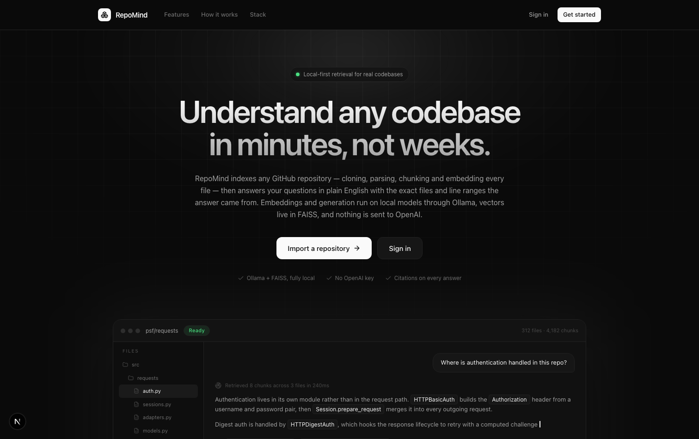
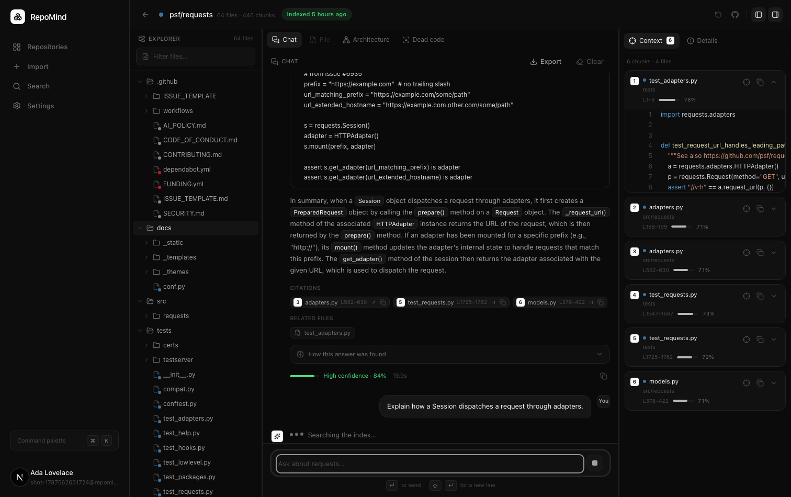
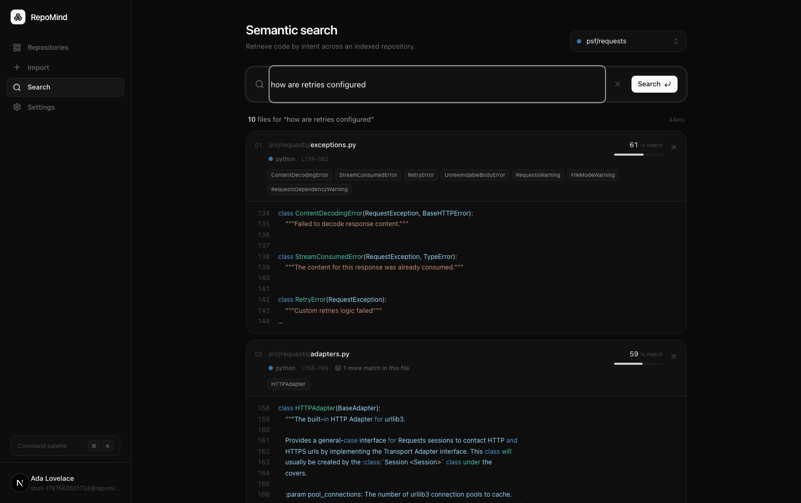
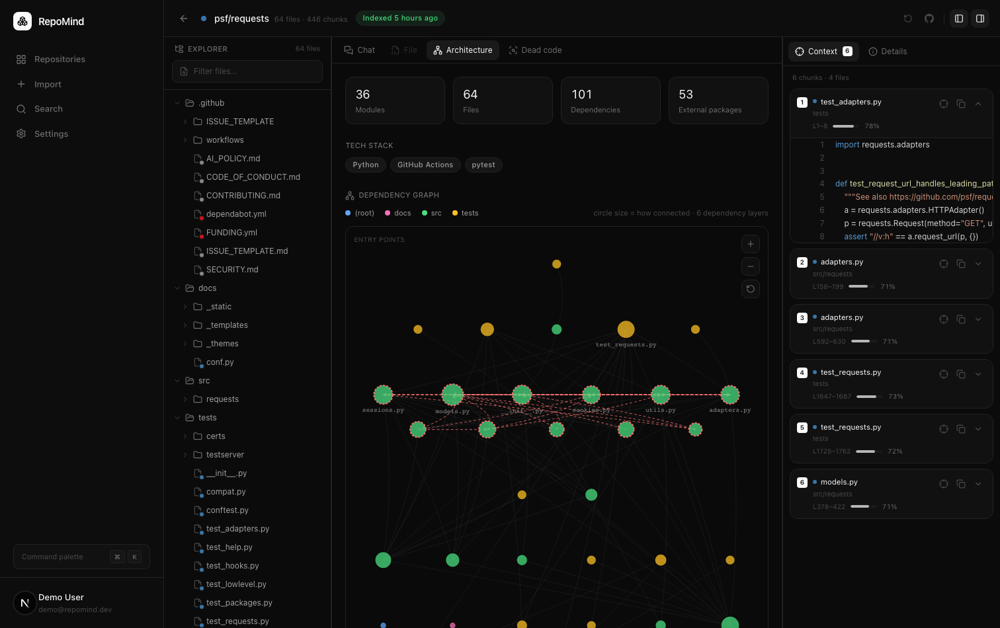
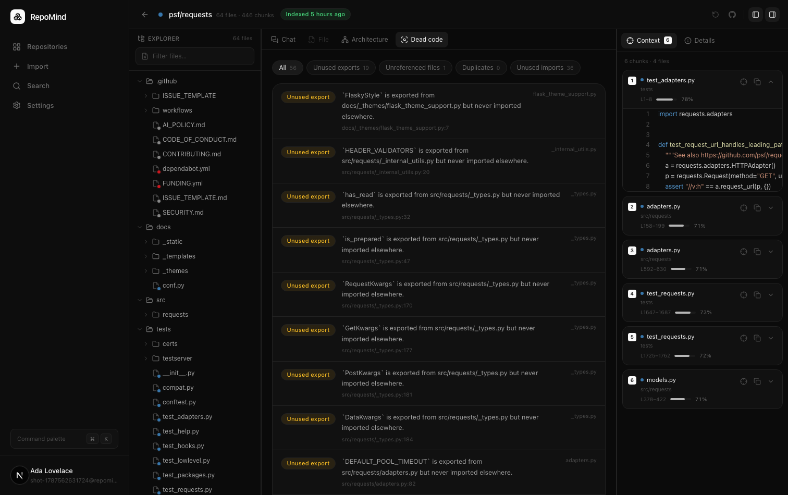

<div align="center">

# RepoMind

**Understand any codebase in minutes, not weeks.**

Import a GitHub repository, and ask questions about it in plain English.
Every answer cites the exact files and line ranges it came from.

Runs entirely on local models through Ollama by default — nothing leaves your
machine. Generation and embeddings are pluggable, so the same code deploys to
free hosting using a hosted endpoint.

</div>



---

## What it does

RepoMind clones a repository, parses it along symbol boundaries, embeds every
chunk locally, and stores the vectors in FAISS. From there you can:

- **Ask questions** and get streamed answers grounded in the real source, with
  numbered citations that open the cited file at the cited lines.
- **Search semantically** — describe behaviour ("how are retries configured")
  rather than guessing identifiers.
- **See the architecture** — an interactive dependency graph built from real
  import resolution, plus detected tech stack and likely entry points.
- **Find dead code** — unused exports, unreferenced modules, duplicate utilities
  and unused imports, all from AST analysis.

Every answer carries a confidence score derived from retrieval strength and
citation behaviour — not from asking a 3B model how sure it feels.

---

## Screenshots

### Workspace — chat with citations

Three resizable panels: the file tree, the conversation, and the exact chunks
that were retrieved to answer the question.



### Semantic search



### Architecture

Modules are stacked by dependency depth — the bottom row depends on nothing else
in the repository — so the shape of the codebase is readable before you interact
with it. Colour is the top-level directory, size is how connected a module is,
and dashed red marks circular imports.



### Dead code



---

## Running it

Once the one-time setup below is done, the whole stack is four scripts:

```bash
scripts/start.sh      # Ollama + backend + frontend, then prints the URLs
scripts/status.sh     # what is running, plus backend dependency health
scripts/logs.sh       # follow the logs live, as a foreground run would show them
scripts/stop.sh       # stop the backend and frontend
scripts/restart.sh    # stop, then start
```

`start.sh` is safe to re-run — anything already listening is left alone — and
the services keep running after you close the terminal.

Because the services are detached, their output goes to `.run/logs/` rather than
a terminal. `scripts/logs.sh` follows all three at once; `scripts/logs.sh backend
--quiet` follows one with SQL statement logging filtered out. Ctrl-C stops
watching without stopping anything.

Two deliberate behaviours worth knowing:

- If a port is held by an unrelated process, the scripts say so and refuse to
  touch it rather than killing something that isn't RepoMind.
- `stop.sh` leaves Ollama running, since it is usually shared with other things.
  Use `stop.sh --all` to stop it too, and only if `start.sh` was what started it.

Useful flags: `start.sh --prod` serves a production build, `start.sh --no-ollama`
skips managing Ollama, and `stop.sh --clean` also clears `frontend/.next`. Ports
can be overridden with `REPOMIND_BACKEND_PORT` and `REPOMIND_FRONTEND_PORT`.

---

## Quick start

You need Python 3.11+, Node 20+, git, and [Ollama](https://ollama.com/download).

```bash
# 1. Models (about 2.3 GB total)
ollama pull nomic-embed-text
ollama pull llama3.2:3b

# 2. Backend
cd backend
python3 -m venv .venv && source .venv/bin/activate
pip install -r requirements.txt
cp .env.example .env
python -c "import secrets; print(secrets.token_urlsafe(48))"   # paste into JWT_SECRET
uvicorn main:app --reload --port 8000

# 3. Frontend (new terminal)
cd frontend
npm install
cp .env.local.example .env.local
npm run dev
```

Open <http://localhost:3000>. The database defaults to SQLite, so there is no
migration step to get going.

After this first run, `scripts/start.sh` handles steps 1–3 in one command.

Confirm every dependency is healthy — the response names anything that is
missing:

```bash
curl http://localhost:8000/api/v1/health/ready
```

### Seed a demo account

```bash
backend/.venv/bin/python database/seed.py --with-repo
```

Creates `demo@repomind.dev` / `demo12345` and fully indexes `psf/requests`
(around 20 seconds on an M-series Mac) so there is something to query right away.

### Docker

```bash
docker compose up --build
```

Brings up Postgres, Ollama, the API and the web app together. See
[docs/setup.md](docs/setup.md) for the GPU caveat on macOS and Windows.

---

## How it works

```
GitHub URL
    │
    ├─ 1. Clone            shallow clone of the default branch
    ├─ 2. Walk             skip node_modules, dist, build, binaries, lockfiles
    ├─ 3. Chunk            language-aware, 300–500 tokens, 50-token overlap,
    │                      split at function/class boundaries where possible
    ├─ 4. Embed            nomic-embed-text via Ollama, batched
    ├─ 5. Index            FAISS inner-product over normalised vectors
    └─ 6. Persist          metadata and chunks in Postgres/SQLite
                                    │
Question ───────────────────────────┤
    │                               │
    ├─ embed the query              │
    ├─ FAISS top-K × multiplier ────┘
    ├─ rerank      lexical overlap · symbol match · path match · per-file diversity
    ├─ generate    llama3.2 over numbered context blocks, streamed as SSE
    └─ analyse     parse [n] markers → citations, related files, confidence
```

The reranker matters more than it looks. Pure vector similarity returns six
chunks from whichever file happens to be closest in embedding space; the
diversity pass guarantees a lower-scoring but relevant file can still reach the
context window. Identifier splitting means `verifyToken` matches a question
asking "where is the token verified".

Full detail, including why each choice was made, is in
[docs/architecture.md](docs/architecture.md).

---

## Tech stack

| Layer | Choice | Why |
| --- | --- | --- |
| Frontend | Next.js 15, React 19, JavaScript, Tailwind v4 | App Router, RSC-ready, no build-time type ceremony |
| Animation | Framer Motion | Layout transitions that survive re-renders |
| Backend | FastAPI, Python 3.13 | Async-native, and the AI ecosystem lives in Python |
| Vectors | FAISS | In-process, no server to run, fast at this scale |
| Embeddings | Ollama · nomic-embed-text, or fastembed | 768-dim, strong on code; the ONNX path needs no GPU |
| Generation | Ollama · llama3.2, or any OpenAI-compatible API | Local by default, hosted when deployed |
| Database | PostgreSQL (SQLite by default) | Relational data with real foreign keys; SQLite keeps setup to zero |
| ORM | SQLAlchemy 2 async | Runtime access |
| Migrations | Prisma | Declarative schema and migration tooling |
| Auth | JWT (access + refresh) | Stateless, with transparent refresh in the client |

Prisma owns the schema; SQLAlchemy owns runtime access. Nothing forces them to
agree, so `backend/tests/test_schema_parity.py` compares every table, column and
enum value between the two and fails if they drift.

---

## Project layout

```
backend/
  ai/            retrieval, reranking, prompts, answer analysis
    llm/         pluggable generation: Ollama and OpenAI-compatible
    codeintel/   AST parsing, module resolution, architecture, dead code
  app/
    api/         routers
    core/        config, security, errors, logging
    services/    orchestration
  database/      SQLAlchemy models and session
  embeddings/    Ollama embedder (+ deterministic offline fallback)
  ingest/        clone, file walk, chunking, symbol extraction
  vectorstore/   FAISS persistence and per-repository registry
  tests/
frontend/
  src/app/       routes: landing, auth, dashboard, import, workspace, search, settings
  src/components/
  src/lib/       API client, auth store, hooks
database/        Prisma schema and seed script
scripts/         start / stop / status / restart for the whole stack
shared/          constants shared by both sides (languages, ignores, retrieval)
docs/
```

`shared/constants.json` is the single definition of supported languages, ignore
rules and retrieval parameters. `frontend/scripts/sync-shared.mjs` vendors it
into the frontend on every `dev` and `build`, so the two sides cannot disagree
about what a `.tsx` file is.

No source file exceeds 300 lines.

---

## Testing

```bash
cd backend && .venv/bin/pytest tests/ -q          # 89 unit tests
```

Covers chunking boundaries and overlap, JWT signing and rejection, path
traversal, GitHub URL parsing, database-URL normalisation for every managed
Postgres provider, retrieval ranking and diversity, AST analysis, dependency
layering and circular-import detection, dead-code rules, and Prisma/SQLAlchemy
schema parity.

Three end-to-end checks run against a live stack:

```bash
# Verifies the API returns exactly what the frontend consumes — 41 assertions
# over a real import, real embeddings, real FAISS and real Ollama.
# Set REPOMIND_API to point at a backend on a non-default port.
backend/.venv/bin/python backend/tests/verify_frontend_contract.py

# Drives the real UI in a headless browser: register, import, watch indexing,
# search, chat with streaming citations, architecture, dead code, sign out.
# Set APP_URL to run it against a deployed instance instead.
cd frontend && node scripts/verify-ui.mjs

# Exercises the architecture graph's gestures: pinch zoom anchored on the
# cursor, drag to pan, and that a drag is not mistaken for a selection.
cd frontend && node scripts/verify-panzoom.mjs

# Proves the app survives its filesystem being wiped, which is what free hosts
# do on every restart. Needs a backend running with EPHEMERAL_FILESYSTEM=true.
backend/.venv/bin/python backend/tests/verify_ephemeral_recovery.py setup
#   ... restart the backend here, so its in-memory index cache is empty ...
backend/.venv/bin/python backend/tests/verify_ephemeral_recovery.py verify
```

> Do not run `npm run build` while `npm run dev` is running — they share
> `.next` and the build overwrites what the dev server is serving. Use
> `NEXT_DIST_DIR=.next-build npm run build` to check a production build safely.

`frontend/scripts/shoot.mjs` regenerates the screenshots in this README.

---

## Documentation

| Document | Contents |
| --- | --- |
| [docs/setup.md](docs/setup.md) | Install, configure, Docker, troubleshooting |
| [docs/architecture.md](docs/architecture.md) | System design and the reasoning behind it |
| [docs/api.md](docs/api.md) | Every endpoint, with request and response shapes |
| [docs/er-diagram.md](docs/er-diagram.md) | Entity relationships and indexing strategy |
| [docs/dead-code.md](docs/dead-code.md) | What each rule detects, and what it cannot |
| [docs/deployment.md](docs/deployment.md) | Free step-by-step deployment, and its trade-offs |

---

## Deployment

**[docs/deployment.md](docs/deployment.md) is a complete free walkthrough** —
Vercel, Render, Neon and Groq, no credit card, about 40 minutes.

The short version of why the deployed build differs: no free host provides a
GPU, and free filesystems are wiped on every restart. Both are configuration
changes, not code changes.

| Concern | Local | Deployed |
| --- | --- | --- |
| Generation | Ollama | Any OpenAI-compatible endpoint (Groq by default) |
| Embeddings | Ollama | fastembed, ONNX in-process on CPU |
| Database | SQLite | Postgres |
| FAISS index and checkout | Files on disk | Rebuilt from Postgres on demand |

That last row is the interesting one. With `EPHEMERAL_FILESYSTEM=true`, indexing
also writes embedding vectors and file text to Postgres, so a restart that
deletes the disk costs milliseconds of rebuild rather than a full re-index — no
re-cloning, no re-embedding, no repeated API calls.

`render.yaml` in the repository root is a working blueprint for the API.

---

## Limitations

Worth stating plainly:

- **Public repositories only.** Cloning is unauthenticated.
- **Dead-code findings are advisory.** Static analysis cannot see dynamic
  imports, dependency injection, reflection or framework conventions. Entry
  points and test files are excluded, but treat results as leads.
- **Answer quality tracks model size.** `llama3.2:3b` is the default because it
  runs anywhere. `qwen2.5-coder:7b` is noticeably better on code — set
  `OLLAMA_CHAT_MODEL` if you have the memory.
- **Indexing is in-process.** Fine for a single instance; a multi-worker
  deployment would need Redis pub/sub for progress and a real task queue. The
  interface is narrow enough that only `app/services/progress.py` changes.
