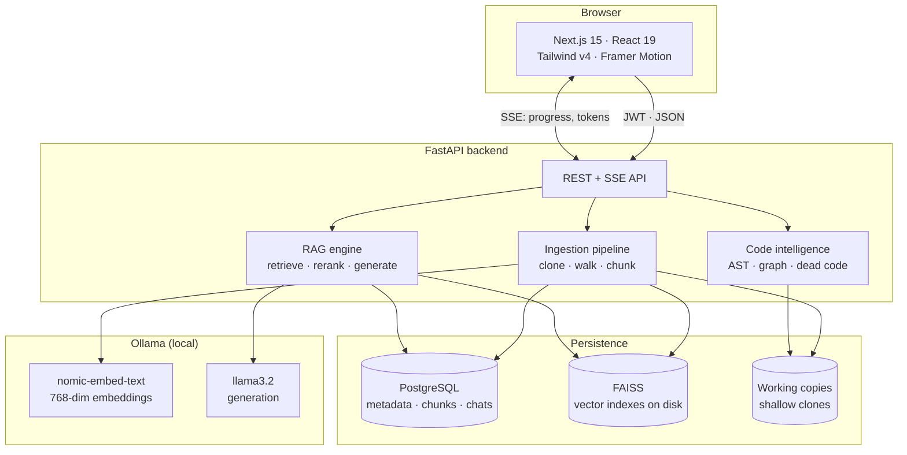
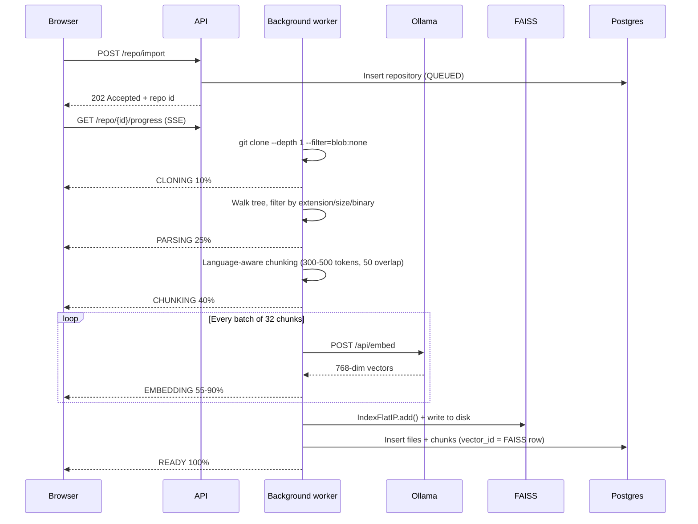

# Architecture

RepoMind turns a GitHub URL into a queryable knowledge base. This document
explains how the pieces fit together and, more importantly, *why* each choice
was made.

---

## System overview

Nothing leaves the machine. Embeddings and generation both run through a local
Ollama instance, so no third-party AI provider ever sees the source code.

---

## The indexing pipeline

An import runs as a background task and reports progress over SSE at every
stage, so the UI can show a live bar instead of a spinner.

### Why these choices

**Shallow clone with `--filter=blob:none`.** Full history is irrelevant to
answering questions about current code. Blob filtering means git fetches file
contents lazily, so importing a large repository stays fast.

**Language-aware chunking.** Chunks are produced by LangChain's
`RecursiveCharacterTextSplitter.from_language`, which prefers to split on
syntactic boundaries — `class`, `def`, `function` — before falling back to blank
lines and then characters. A chunk that stops mid-function retrieves poorly
because it embeds an incomplete thought.

**Exact line ranges.** After splitting, each chunk is located in the original
source to compute its true start and end line. This is what makes a citation
clickable: `src/requests/auth.py:1-31` points at real lines, not an estimate.
The chunker is verified against this property in `backend/tests/test_chunker.py`.

**Provenance in the embedded text.** Each chunk is embedded with a header
naming its file path and the symbols it defines. A query like *"where is JWT
verified"* can then match on the identifier `verify_token` even when the
surrounding prose uses different words.

---

## Retrieval

**Asymmetric embedding.** `nomic-embed-text` is trained with task prefixes.
Documents are embedded with `search_document:` and queries with `search_query:`.
Using the correct prefix on each side measurably improves ranking.

**Cosine via inner product.** Vectors are L2-normalised before insertion into a
FAISS `IndexFlatIP`, which makes the inner product exactly cosine similarity.
Flat search is exhaustive and therefore exact. At repository scale — tens of
thousands of chunks — it returns in well under a millisecond and, unlike
IVF or HNSW, requires no training step and never silently misses a neighbour.

**Why rerank at all.** Pure vector similarity has two failure modes on code.
Identifier matches are strong evidence that embeddings under-weight, and the
top-k by raw score is frequently six chunks from the same large file. The
reranker blends four signals and then caps chunks per file:

| Signal | Weight | Rationale |
| --- | --- | --- |
| Vector similarity | 0.70 | Semantic backbone |
| Lexical overlap | 0.20 | Exact term matches, length-damped |
| Symbol match | 0.10 | `verifyToken` matching "verify token" |
| Path match | +0.05 bonus | `auth/` matching "authentication" |

**Honest confidence.** Confidence is computed from retrieval evidence — the
strength and agreement of the top hits, and how many blocks the model actually
cited — not self-reported by the model. A 3B model asked to rate its own
certainty produces noise. An answer that hedges ("not found in the context") is
also damped, so the number reflects real grounding.

---

## Request lifecycle: asking a question

The chat endpoint streams Server-Sent Events in a fixed order:

1. `context` — the retrieved chunks, sent **before** generation begins so the
   right-hand panel fills in immediately rather than after the answer.
2. `token` — incremental text deltas as the model produces them.
3. `done` — the persisted message with citations, confidence and related files.

It is a `POST` rather than an `EventSource`/`GET` stream because questions run to
4000 characters, which does not fit reliably in a URL. The frontend consumes it
with `fetch` and a `ReadableStream` reader.

A subtle constraint drove one design decision: FastAPI closes dependencies that
use `yield` *before* a `StreamingResponse` body is consumed. The streaming
generator therefore opens its own database session rather than borrowing the
request-scoped one, which would already be closed by the time the first token
arrives.

---

## Code intelligence

The architecture graph and dead-code detector share one module graph, built once
per repository and cached.

- **Python** is analysed with the standard library `ast`. Names are recorded as
  referenced only in a `Load` context, so a function that is defined but never
  called is genuinely detected as dead.
- **JavaScript / TypeScript** is analysed with scoped regexes. Shipping a JS
  parser into a Python service is a heavy dependency for a linting feature, so
  the trade-off is documented and the rules are deliberately conservative. See
  [dead-code.md](./dead-code.md).

Import resolution handles relative paths, bundler aliases (`@/`), extension and
`index` resolution for JS, and dotted module paths plus package directories for
Python. Getting this right matters: an unresolved import silently becomes a
false "unreferenced file" report.

---

## Layout

| Directory | Contents |
| --- | --- |
| `frontend/` | Next.js 15 app — pages, components, API client |
| `backend/app/` | FastAPI: routes, schemas, services, core config |
| `backend/ai/` | LLM client, prompts, retrieval, reranking, code intelligence |
| `backend/embeddings/` | Embedding providers (Ollama + offline fallback) |
| `backend/vectorstore/` | FAISS wrapper and per-repository index registry |
| `backend/ingest/` | Clone, file walking, chunking, symbol extraction |
| `backend/database/` | SQLAlchemy models and session management |
| `database/` | Prisma schema (canonical), migrations, seed script |
| `faiss/indexes/` | Persisted vector indexes, one directory per repository |
| `shared/` | `constants.json` — one source of truth for both languages |
| `docs/` | This documentation |

`shared/constants.json` defines the language map, ignore rules, chunking targets
and retrieval parameters. The backend reads it directly; the frontend vendors a
copy at build time. Because both sides read the same file, the language badge
the UI renders can never disagree with what the pipeline actually indexed.

---

## Deliberate trade-offs

**SQLAlchemy at runtime, Prisma as the canonical schema.** The backend is
Python, so Prisma Client cannot drive it. Prisma owns the schema definition and
migrations (and is the deliverable ER artefact); SQLAlchemy maps the same tables
with identical column names and enum values. Both are checked in and kept in
sync by hand — a small cost for a readable schema plus a native async ORM.

**In-memory progress pub/sub.** Indexing progress is ephemeral UI state and the
authoritative status is always in Postgres, so a process-local pub/sub is
sufficient and dependency-free. Scaling past one worker means swapping it for
Redis; the interface is narrow enough that only `app/services/progress.py`
changes.

**Flat FAISS indexes.** Exact and untrained, at the cost of linear scan time.
The crossover where IVF would win is far beyond a single repository.

**Character-ratio token estimation.** Chunk sizes and context budgets are
estimated at roughly four characters per token instead of running a real
tokeniser. It avoids a heavy dependency, and the number is only ever used for
budgeting — never for billing or hard limits.
