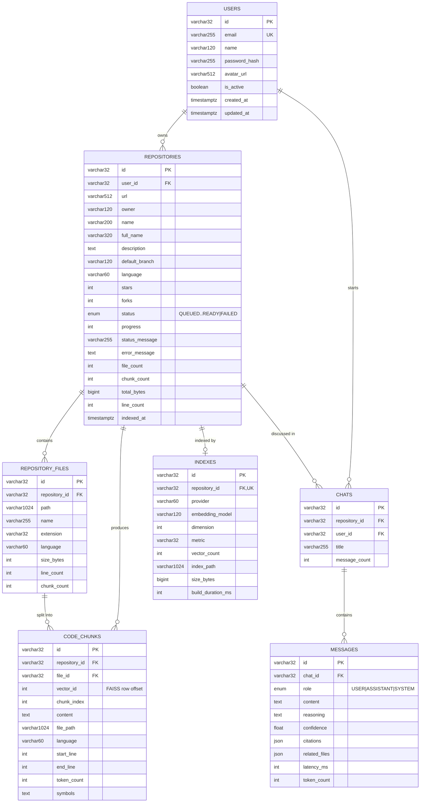

# Entity-relationship model

The canonical definition lives in
[`database/prisma/schema.prisma`](../database/prisma/schema.prisma). The FastAPI
backend maps the same tables with SQLAlchemy in `backend/database/models/`.

## Notes on the design

**`code_chunks.vector_id` is the bridge to FAISS.** It stores the row offset of
the chunk's embedding inside the repository's index. A similarity search returns
row numbers; those map back to chunk ids, which carry the file path and line
range that become a citation. The pair `(repository_id, vector_id)` is unique.

**Chunk text lives in Postgres, vectors live on disk.** Storing the text in both
places would duplicate megabytes per repository. FAISS holds vectors plus an
ordered list of chunk ids; everything human-readable is hydrated from the
database after the search returns.

**File contents are not stored at all.** `repository_files` holds only metadata.
The file viewer reads from the shallow clone on disk, which keeps the database
small. Deleting the working copy therefore disables the viewer but leaves search
and chat fully functional, since retrieval only needs chunk text.

**Citations are denormalised onto messages.** `messages.citations` and
`related_files` are JSON snapshots taken at answer time. Re-deriving them later
would produce different results as the index changes, so a reloaded conversation
would no longer match what the user actually saw.

**Cascades are enforced by the database.** Every foreign key declares
`ON DELETE CASCADE`, and the ORM relationships set `passive_deletes=True` so
deleting a repository does not have to load tens of thousands of chunk rows into
memory first. SQLite needs `PRAGMA foreign_keys=ON` for this, which the engine
sets on every connection.

**Uniqueness.** `(user_id, full_name)` prevents importing the same repository
twice into one workspace, while still allowing different users to import it
independently.
